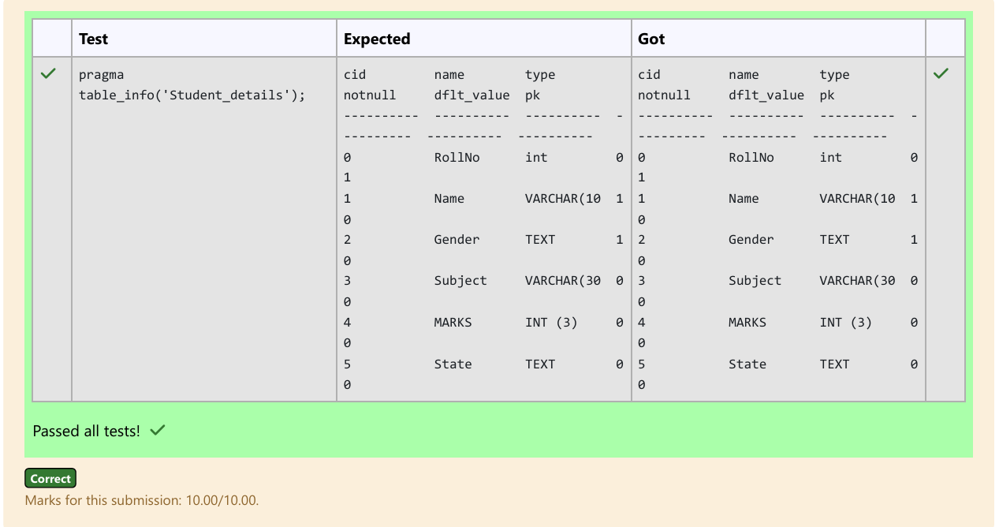
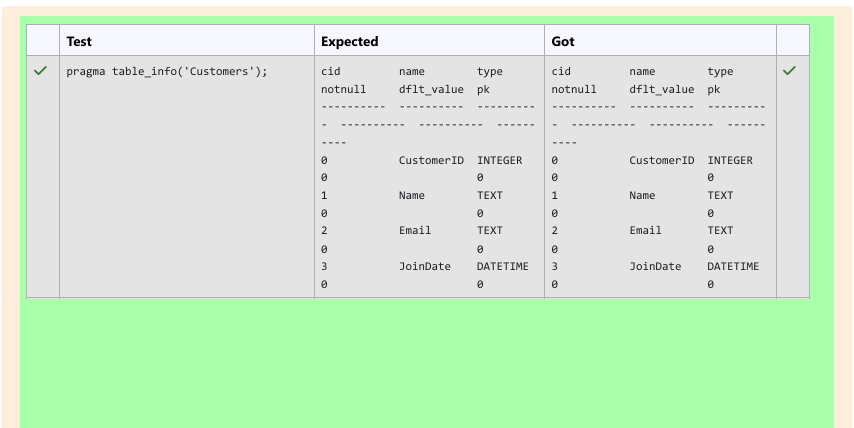
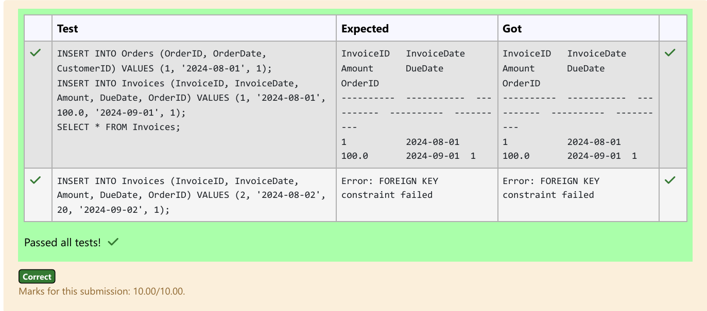
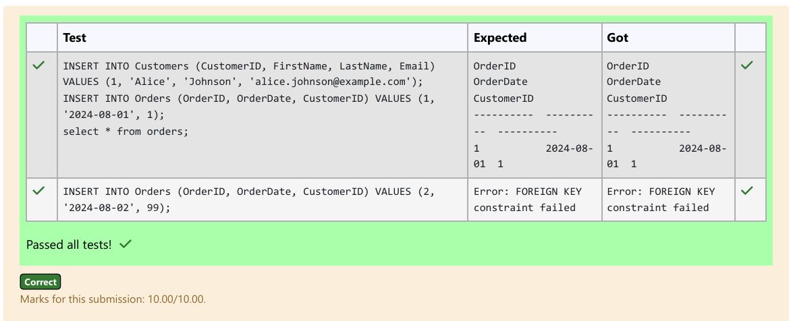
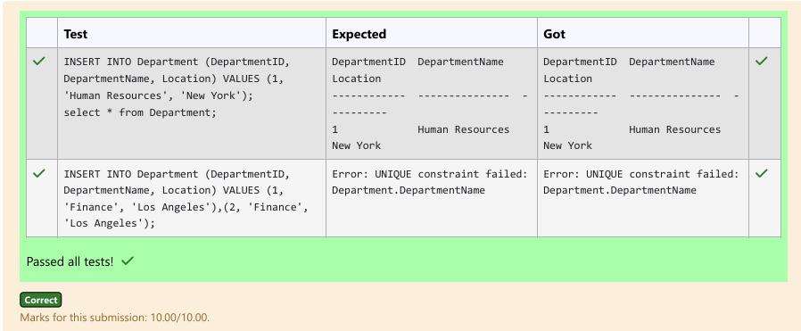

# Experiment 2: DDL Commands

## AIM
To study and implement DDL commands and different types of constraints.

## THEORY

### 1. CREATE
Used to create a new relation (table).

**Syntax:**
```sql
CREATE TABLE (
  field_1 data_type(size),
  field_2 data_type(size),
  ...
);
```
### 2. ALTER
Used to add, modify, drop, or rename fields in an existing relation.
(a) ADD
```sql
ALTER TABLE std ADD (Address CHAR(10));
```
(b) MODIFY
```sql
ALTER TABLE relation_name MODIFY (field_1 new_data_type(size));
```
(c) DROP
```sql
ALTER TABLE relation_name DROP COLUMN field_name;
```
(d) RENAME
```sql
ALTER TABLE relation_name RENAME COLUMN old_field_name TO new_field_name;
```
### 3. DROP TABLE
Used to permanently delete the structure and data of a table.
```sql
DROP TABLE relation_name;
```
### 4. RENAME
Used to rename an existing database object.
```sql
RENAME TABLE old_relation_name TO new_relation_name;
```
### CONSTRAINTS
Constraints are used to specify rules for the data in a table. If there is any violation between the constraint and the data action, the action is aborted by the constraint. It can be specified when the table is created (using CREATE TABLE) or after it is created (using ALTER TABLE).
### 1. NOT NULL
When a column is defined as NOT NULL, it becomes mandatory to enter a value in that column.
Syntax:
```sql
CREATE TABLE Table_Name (
  column_name data_type(size) NOT NULL
);
```
### 2. UNIQUE
Ensures that values in a column are unique.
Syntax:
```sql
CREATE TABLE Table_Name (
  column_name data_type(size) UNIQUE
);
```
### 3. CHECK
Specifies a condition that each row must satisfy.
Syntax:
```sql
CREATE TABLE Table_Name (
  column_name data_type(size) CHECK (logical_expression)
);
```
### 4. PRIMARY KEY
Used to uniquely identify each record in a table.
Properties:
Must contain unique values.
Cannot be null.
Should contain minimal fields.
Syntax:
```sql
CREATE TABLE Table_Name (
  column_name data_type(size) PRIMARY KEY
);
```
### 5. FOREIGN KEY
Used to reference the primary key of another table.
Syntax:
```sql
CREATE TABLE Table_Name (
  column_name data_type(size),
  FOREIGN KEY (column_name) REFERENCES other_table(column)
);
```
### 6. DEFAULT
Used to insert a default value into a column if no value is specified.

Syntax:
```sql
CREATE TABLE Table_Name (
  col_name1 data_type,
  col_name2 data_type,
  col_name3 data_type DEFAULT 'default_value'
);
```
### MODULE QUESTIONS
```
NAME -  GOWTHAM V
REGISTER NUMBER - 212223100009
```

**Question 1**

Write a SQL query to Add a new column State as text in the Student_details table.


```
ALTER TABLE Student_details ADD COLUMN State TEXT;
```
**Output:**



**Question 2**

Insert the below data into the Employee table, allowing the Department and Salary columns to take their default values.


```
INSERT INTO Employee(EmployeeID,Name,Position)

VALUES('4','Emily White','Analyst');
```
**Output:**


**Question 3**

Insert all employees from Former_employees into Employee


```
INSERT into Employee(EmployeeID,Name,Department,Salary)

SELECT EmployeeID,Name,Department,Salary FROM Former_employees;
```

**Output:**


**Question 4**

Create a table named Customers with the following columns:


```
CREATE TABLE Customers(

CustomerID INTEGER,

Name TEXT,

Email TEXT,

JoinDate DATETIME );
```

**Output:**



**Question 5**

Write an SQL query to add a new column email of type TEXT to the Student_details table, and ensure that this column cannot contain NULL values and make default value as 'Invalid'


```
ALTER TABLE Student_details

ADD COLUMN email TEXT not NULL default'Invalid';
```

**Output:**


**Question 6**

Create a table named Invoices with the following constraints:

InvoiceID as INTEGER should be the primary key.

InvoiceDate as DATE.

Amount as REAL should be greater than 0.

DueDate as DATE should be greater than the InvoiceDate.

OrderID as INTEGER should be a foreign key referencing Orders(OrderID).


```
CREATE TABLE Invoices(

InvoiceID INTEGER primary key,

InvoiceDate DATE,

Amount REAL CHECK(Amount>=0),

DueDate DATE CHECK(DueDate>=InvoiceDate),

OrderID INTEGER,

foreign key (OrderID) references Orders(OrderID) );
```

**Output:**



**Question 7**

Create a table named Products with the following constraints:

ProductID should be the primary key.

ProductName should be NOT NULL.

Price is of real datatype and should be greater than 0.

Stock is of integer datatype and should be greater than or equal to 0.


```
CREATE TABLE Products(

ProductID INTEGER primary key,

ProductName not NULL,

Price REAL CHECK (Price>0),

Stock INTEGER CHECK (Stock>=0) );
```

**Output:**


**Question 8**

Create a table named Orders with the following constraints:

OrderID as INTEGER should be the primary key.

OrderDate as DATE should be not NULL.

CustomerID as INTEGER should be a foreign key referencing Customers(CustomerID).


```
CREATE TABLE Orders(

OrderID INTEGER primary key,

OrderDate DATE not NULL,

CustomerID INTEGER,

foreign key (CustomerID) references Customers(CustomerID) );
```

**Output:**



**Question 9**

Create a table named Department with the following constraints:

DepartmentID as INTEGER should be the primary key.

DepartmentName as TEXT should be unique and not NULL.

Location as TEXT.


```
CREATE TABLE Department(

DepartmentID INTEGER primary key,

DepartmentName TEXT UNIQUE not NULL,

Location TEXT );
```

**Output:**




**Question 10**

In the Books table, insert a record where some fields are NULL, another record where all fields are filled without any NULL values, and a third record where some fields are filled, and others are left as NULL.


```
INSERT INTO Books(ISBN, Title, Author, Publisher, Year)

VALUES('978-1234567890', 'Introduction to AI', 'John Doe', null, null);

INSERT INTO Books(ISBN, Title, Author, Publisher, Year)

VALUES('978-9876543210', 'Deep Learning', 'Jane Doe', 'TechPress', '2022');

INSERT INTO Books(ISBN, Title, Author, Publisher, Year)

VALUES('978-1122334455', 'Cybersecurity Essentials', 'Alice Smith', null, 2021);
```

**Output:**


## RESULT

Thus, the SQL queries to implement different types of constraints and DDL commands have been executed successfully.
