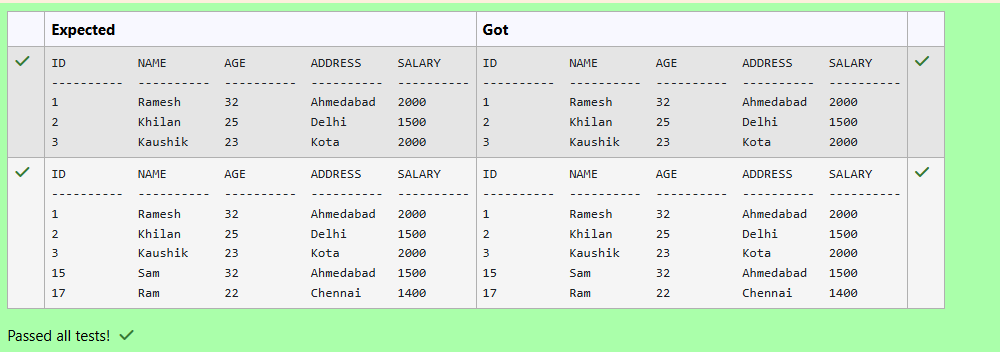
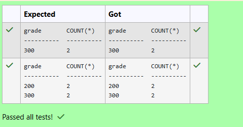
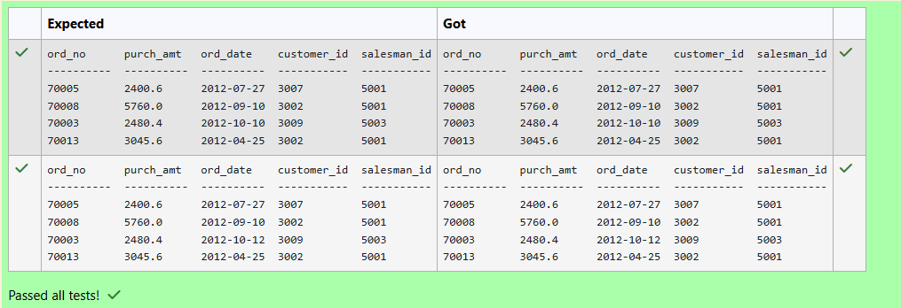
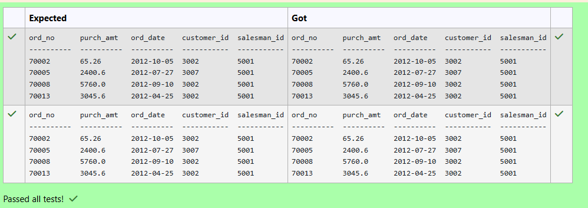
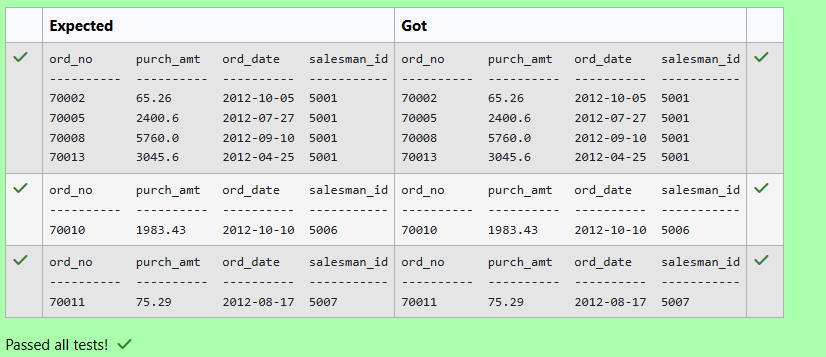

# Experiment 5: Subqueries and Views

## AIM
To study and implement subqueries and views.

## THEORY

### Subqueries
A subquery is a query inside another SQL query and is embedded in:
- WHERE clause
- HAVING clause
- FROM clause

**Types:**
- **Single-row subquery**:
  Sub queries can also return more than one value. Such results should be made use along with the operators in and any.
- **Multiple-row subquery**:
  Here more than one subquery is used. These multiple sub queries are combined by means of ‘and’ & ‘or’ keywords.
- **Correlated subquery**:
  A subquery is evaluated once for the entire parent statement whereas a correlated Sub query is evaluated once per row processed by the parent statement.

**Example:**
```sql
SELECT * FROM employees
WHERE salary > (SELECT AVG(salary) FROM employees);
```
### Views
A view is a virtual table based on the result of an SQL SELECT query.
**Create View:**
```sql
CREATE VIEW view_name AS
SELECT column1, column2 FROM table_name WHERE condition;
```
**Drop View:**
```sql
DROP VIEW view_name;
```

### MODULE QUESTIONS
```
NAME -  GOWTHAM V
REGISTER NUMBER - 212223100009
```

**Question 1**
--
Write a SQL query that retrieve all the columns from the table "Grades", where the grade is equal to the maximum grade achieved in each subject.
Sample table: GRADES (attributes: student_id, student_name, subject, grade)

```sql
SELECT *
FROM GRADES g
WHERE grade = (
    SELECT MAX(grade)
    FROM GRADES
    WHERE subject = g.subject
);

```

**Output:**


**Question 2**
---
Write a SQL query to Identify customers whose city is different from the city of the customer with the highest ID

SAMPLE TABLE: customer
```
name             type
---------------  ---------------
id               INTEGER
name             TEXT
city             TEXT
email            TEXT
phone            INTEGER
```

```sql
SELECT *
FROM customer
WHERE city <> (
    SELECT city
    FROM customer
    WHERE id = (SELECT MAX(id) FROM customer)
);

```

**Output:**


**Question 3**
---
Write a SQL query to retrieve all columns from the CUSTOMERS table for customers whose salary is LESS than $2500.

Sample table: CUSTOMERS
```
ID          NAME        AGE         ADDRESS     SALARY
----------  ----------  ----------  ----------  ----------

1          Ramesh     32              Ahmedabad     2000
2          Khilan        25              Delhi                 1500
3          Kaushik      23              Kota                  2000
4          Chaitali       25             Mumbai            6500
5          Hardik        27              Bhopal              8500
6          Komal         22              Hyderabad       4500

7           Muffy          24              Indore            10000

```

```sql
SELECT *
FROM CUSTOMERS
WHERE SALARY < 2500;

```

**Output:**




**Question 4**
---
From the following tables write a SQL query to count the number of customers with grades above the average in New York City. Return grade and count.

customer table
```
name         type
-----------  ----------
customer_id  int
cust_name    text
city         text
grade        int
salesman_id  int
```

```sql
SELECT grade, COUNT(*)
FROM customer
WHERE  grade > (SELECT AVG(grade) FROM customer WHERE city = 'New York')
GROUP BY grade;

```

**Output:**




**Question 5**
---
Write a SQL query to retrieve all columns from the CUSTOMERS table for customers whose Address as Delhi

Sample table: CUSTOMERS
```
ID          NAME        AGE         ADDRESS     SALARY
----------  ----------  ----------  ----------  ----------

1          Ramesh     32              Ahmedabad     2000
2          Khilan        25              Delhi                 1500
3          Kaushik      23              Kota                  2000
4          Chaitali       25             Mumbai            6500
5          Hardik        27              Bhopal              8500
6          Komal         22              Hyderabad       4500

7           Muffy          24              Indore            10000
```

```sql
SELECT *
FROM CUSTOMERS
WHERE ADDRESS = 'Delhi';

```

**Output:**


**Question 6**
---
From the following tables write a SQL query to find the order values greater than the average order value of 10th October 2012. Return ord_no, purch_amt, ord_date, customer_id, salesman_id.

Note: date should be yyyy-mm-dd format

ORDERS TABLE
```
name            type
----------     ----------
ord_no          int
purch_amt    real
ord_date       text
customer_id  int
salesman_id  int
```

```sql
SELECT ord_no, purch_amt, ord_date, customer_id, salesman_id
FROM ORDERS
WHERE purch_amt > (
    SELECT AVG(purch_amt)
    FROM ORDERS
    WHERE ord_date = '2012-10-10'
);

```

**Output:**




**Question 7**
---
From the following tables write a SQL query to find all orders generated by New York-based salespeople. Return ord_no, purch_amt, ord_date, customer_id, salesman_id.

salesman table
```
name             type
---------------  ---------------
salesman_id      numeric(5)
name                 varchar(30)
city                    varchar(15)
commission       decimal(5,2)
```
orders table
```
name             type
---------------  --------
order_no         int
purch_amt        real
order_date       text
customer_id      int
salesman_id      int
```

```sql
SELECT o.ord_no, o.purch_amt, o.ord_date, o.customer_id, o.salesman_id
FROM orders o
JOIN salesman s ON o.salesman_id = s.salesman_id
WHERE s.city = 'New York';

```

**Output:**



**Question 8**
---
From the following tables, write a SQL query to find those salespeople who earned the maximum commission. Return ord_no, purch_amt, ord_date, and salesman_id.

salesman table
```
name             type
---------------  ---------------
salesman_id      numeric(5)
name                 varchar(30)
city                    varchar(15)
commission       decimal(5,2)
```
orders table
```
name             type
---------------  --------
order_no         int
purch_amt        real
order_date       text
customer_id      int
salesman_id      int
```

```sql
SELECT o.ord_no, o.purch_amt, o.ord_date, o.salesman_id
FROM orders o
JOIN salesman s ON o.salesman_id = s.salesman_id
WHERE s.commission = (
    SELECT MAX(commission)
    FROM salesman
);

```

**Output:**




**Question 9**
---
From the following tables, write a SQL query to find all the orders generated in New York city. Return ord_no, purch_amt, ord_date, customer_id and salesman_id.

SALESMAN TABLE
```
name               type
-----------        ----------
salesman_id  numeric(5)
name             varchar(30)
city                 varchar(15)
commission   decimal(5,2)
```
ORDERS TABLE
```
name            type
----------      ----------
ord_no          int
purch_amt    real
ord_date       text
customer_id  int
salesman_id  int
```

```sql
SELECT o.ord_no, o.purch_amt, o.ord_date, o.customer_id, o.salesman_id
FROM orders o
JOIN salesman s ON o.salesman_id = s.salesman_id
WHERE s.city = 'New York';

```

**Output:**


**Question 10**
---
Write a SQL query that retrieves the all the columns from the Table Grades, where the grade is equal to the minimum grade achieved in each subject.

Sample table: GRADES (attributes: student_id, student_name, subject, grade)


```sql
SELECT student_id, student_name, subject, grade
FROM Grades g
WHERE grade = (
    SELECT MIN(grade)
    FROM Grades
    WHERE subject = g.subject
);

```

**Output:**


## RESULT
Thus, the SQL queries to implement subqueries and views have been executed successfully.
